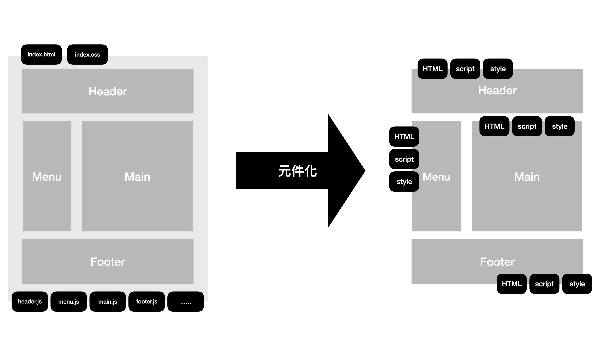
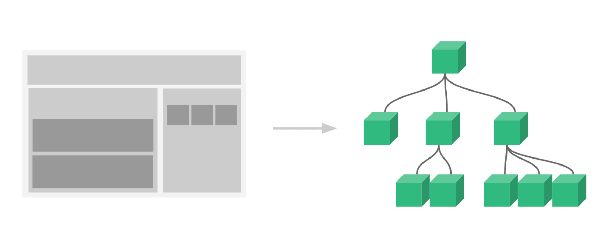
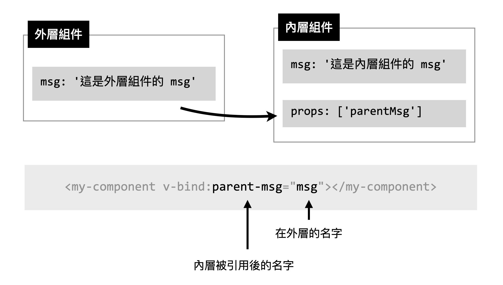
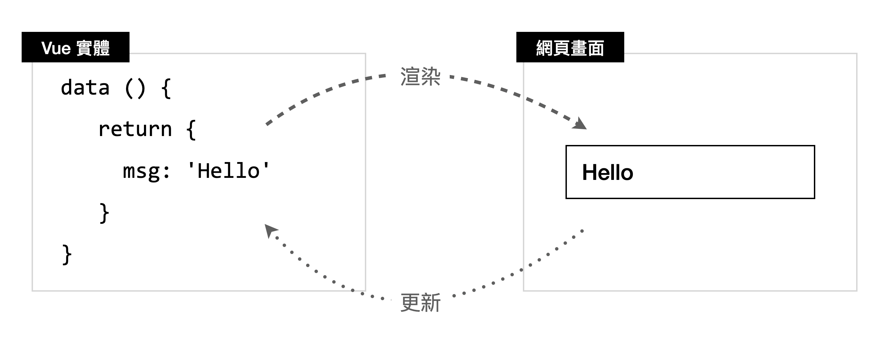

- 元件( Component ) 是 Vue 最主要也是最強大的特性，它提供 HTML DOM 元素擴充性，也可將部分模板、程式碼封裝起來以便開發者維護以及重複使用
  

  ```html
  <div id="app">
    <header-component>...</header-component>
    <menu-component>...</menu-component>
    <main-component>...</main-component>
    <footer-component>...</footer-component>
  </div>
  ```

  

- 每一個被封裝後的元件單元，都含有自己的模板、樣式，與行為邏輯，並且可以被重複使用。
- 而在元件之中又可以含有元件，這樣由一個個元件單元組合而成的「元件樹」，就是 Vue.js 元件系統的概念。

- Vue.js 每個元件的實體狀態、模板等作用範圍都應該要是獨立的，這意味著我們不能（也不應該）在子元件的模組「直接」去修改父元件，甚至是另一個元件的資料，
- 但是當我們切分元件的時候，就是希望能夠重複利用這個元件，我們希望這個元件可以根據「外部」傳入的資料來反映出不同的結果。
- 那麼，既然不能直接取用，那麼上下層元件之間，若需要從外部引進資料時，就需要透過 `props` 屬性來引用外部的狀態。

```html
<div id="app">
  <!-- 這是外層元件的 msg -->
  <h3>{{ msg }}</h3>
  <!-- 這裡的 v-bind:parent-msg 可以簡寫為 :parent-msg -->
  <my-component v-bind:parent-msg="msg"></my-component>
</div>
```



- 在內層元件 (或稱子元件) 宣告 props 屬性，最簡單的方式就是透過「陣列」的型態，

```js
app.component("my-component", {
    props:['props1','props2','props3',...],
});
```

- 這樣我們就可以透過 HTML 標籤內的屬性將外層的狀態引入至對應的 props ：

```html
<my-component :props1="..." :props2="..." :props3="..."></my-component>
```

- 先談談 Vue.js 資料的「雙向綁定」 與 「單向資料流」。
- 在前一章介紹指令的部分，我們提到了 `v-model` 會針對 Vue 實體內的狀態( `data` ) 與畫面上表單元素 (如 `input` 等) 進行綁定，當表單元素的 `value` 被更新的時候，Vue.js 就會直接反映至實體對應的狀態。
- 這樣的作用，我們通常稱它叫資料的「雙向綁定」 (Two-way Data Binding)。


